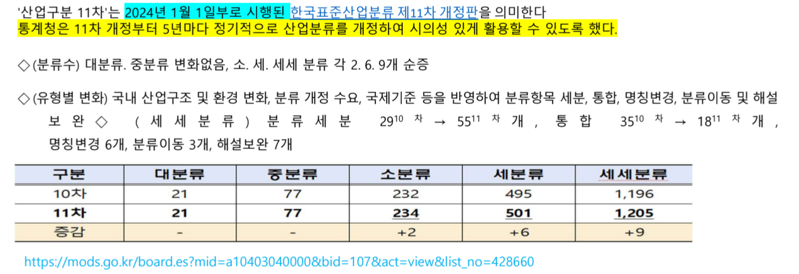
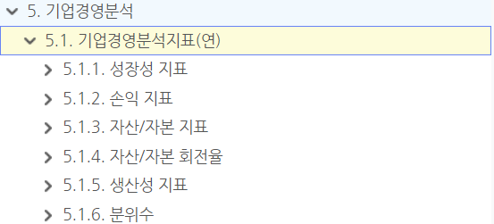

팀장: 혜원
서기(오전 수업기록, 회의기록, 교수님 피드백 기록): 혜원(목-영경), 영경, 윤태
간식 담당: 혜원

규칙 (벌칙):
- 지각시-> 커피 쏘기
- 결석시->  밥 사기
- 자신이 맡은 일 기한까지 못함 -> 간식, 커피 사기
- 모든건 다수결로 결정함

팀명: RiskPulse

논문발표 : 영경, 윤태
기획발표 : 영경
중간발표 : 혜원
최종발표 : 윤태

+자산배분, 투자전략 할거임? : 일단 목표는 더 파생해서 프로젝트를 할 것임. 리스크 관련해서 프로젝트 할 예정

> 부실기업 예측 논문: 머신러닝 기반 기업부도위험 예측모델 검증 및 정책적 제언: 스태킹 앙상블 모델을 통한 개선을 중심으로
> 알고리즘 논문: A survey on deep learning for financial risk prediction

[참고] 프로젝트 절차

[참고] 부실예측 모형이 갖추어야 하는 속성

-----
# 1. 선행연구 / 현황
[양식]
    

----
# 2. 문제 정의

## 2-1. 연구 배경

[예시]
기업 부실 증가 현황
조기경보시스템(EWS)의 필요성
금융기관/투자자 관점 중요성
기존 연구 한계

## 2-2. 연구 목적

[예시]
부실기업 조기예측
설명가능한 리스크 탐지
산업/국면별 차이 분석

## 2-3. 연구 가설

[예시]
H1 : 재무건전성 악화는 부실확률을 증가시킨다.
H2 : 거시경제 변수는 부실예측 성능을 개선한다.
H3 : 머신러닝 모델은 전통 통계모형보다 예측력이 우수하다.

## 2-4. 프로젝트 일정(Time Table)

## 2-5. 사용자, 사용자의 활용목적

[발표준비]
- 연구흐름을 한 페이지에 집어넣을 것
- 논리적 보고서 -> 알기 쉬운 보고서 -> 전달력이 아름다운 보고서
- 기획서에 성능향상을 위해서, 하이퍼파라미터 최적화 방법이라던가, cross-validation 어떻게 할지에 대해서 정리할것
- '파라미터 설정한 것에 대한 내용' 부록에다가 집어넣기
- 스케일링을 했을때랑, 안했을때의 모델 성능차이가 얼마나 차이가 나는지 확인

----
# 3. 연구설계
## 3-1. 연구대상기업 선정

### a. 기업 범위, 시장 구분(Kospi, Kosdaq)
1. 상장기업 VS 비상장기업 
- (상장기업의 경우도 시장별 : 코스피시장, 코스닥시장)
- 금융업종 제외 : 별도 회계기준 적용 , 금융회사에게 정상적인 높은 레버리지 상황이 비금융회사에게는 같은 의미를 가지지 않기 때문
- 결산월 : 12월 결산법인 
     결산월의 차이 ? (분자의 회계 재무변수와 분모의 시가총액 시점이 일치하지 않는다는 점)

2. 외감기업VS 비외감기업
3. 제조업 vs 비제조업 (서비스업) 
[참고] 

### b. 산업 분류
4. 산업별 : 섹터별/ 업종별로 세분화 , 일반업종 VS IT업종 , 수출업종과 그 외, 주력산업과 그외

### c. 기업 규모
5. 기업규모별 : 대 / 중소기업 , 중소형주

### d. 경기 국면 고려
- 경기국면을 고려 ( GDP+물가, 금리)

### 고민해봐야할 문제
-  상장기업 : KOSPI는 코스닥 대비 부도기업이 부족 
-  산업별 표본 불균형
- 생존편향(Survivorship Bias)
-  비상장기업을 표본에 포함시키는 것은 비상장기업의 재무자료 신뢰성 문제 -> 연구결과가 왜곡 가능성 존재

## 3-2. 부실기업 정의
[참고] 
용어를 임의로 정하지 말고 근거와 기준을 가지고 정의

상장기업

상장폐지
ts2000에서 상장 폐지 사유를 가져올 때
→ : 부도발생, 화의절차개시신청, 회사정리절차 개시신청, 감사인의 의견 거절, 은행거래 정지

대부분의 중소기업 B , 신용등급이 안좋을 것 같으면 평가를 받지 않음

## 3-3. 피처 선택
[참고] 데이터 분석 목적 중요 -> 재무비율 우선선위 선정가능 (피처 선정)
우선 가능한 데이터들 선별해서 가져오려고 하지 말고, 다 가져오고 나서 차원축소 해서 피처 수를 줄이면 됨

[참고]
대분류

고려할 파생변수

상장기업에 적용할 수 있는 피처

상장기업이 아니여도 적용할 수 있는 피처

ECOS에서 이 지표들 피처로 사용 권장

교수님께서 말씀하신 부도예측시 중요한 피처
1. 이자보상비율 1이상
2. 부채비율 300% 이상

### a. 데이터수집 가능 여부 +출처 명시 
[참고]
- 수집기간: 연구를 하면 보통 기간을 최대 2024까지 
    [이유] 예를 들어 지금이 2026년이라고 해도:,2025 사업보고서 아직 미완성, 외감 보고 지연, 재무제표 수정, 상장폐지 기업 정리 지연, 부도 여부 확정 지연 등 때문에  “확정된(clean) 데이터”를 확보하기 어려워서 최근 2년 데이터는 사용하지 않음. 

### b. 통계적 유의성 파악 (피처 셀렉)
[참고] t-통계량, 회귀분석(beta)

### c. 피처에 대한 요약 + 데이터 출처도 같이 정리
피처들이 부실기업(1), 정상기업(0) 중 어디가 더 높은지 정리 (이해하기 위한 목적)
ex. 부채비율은 부실기업(1)에서 더 높다. 

----
# 4. 데이터 수집 및 전처리
## 4-1. 데이터 수집 및 병합
- 데이터 병합기준 -> 기업코드? 연도기준? 

[참고]
- 재무제표 사용 시 IFRS, GAAP 구분 -> 연결 재무제표 사용
- 상장 전과 후의 재무데이터를 합치는 경우 상장 전에 연결 재무제표가 없다면 상장 전	개별, 상장 후	연결 합치기

## 4-2. 변수 기준시점 정렬 기준시점 통일

## 4-3. EDA

### a.기초 통계량
[참고]feature 상관분석 하기 전에 describe()로 기술 통계량 확인

### b. 분포확인
- 정규성 만족하는지 확인 목적
    [이유] 정규성을 왜 만족해야하는가? 통계적 추론(p-value, 신뢰구간 등)이 제대로 성립하도록 하기 위해서

### c. 결측치 확인
### d. 상관분석

## 4-4. 결측치처리
[처리방법]

## 4-5. 이상치 처리
[탐지방법]

[처리방법]

## 4-6. 변수 변환 
- 단위 통일
- 정규성 검정 및 전처리 (로그변환)
- 정상성 검정 및 전처리 (차분)

[참고]
-  기업규모에 따른 부도확률 차이를 반영하기 위해 총자산의 자연로그 전처리할 것

## 4-7. 시차(Lag) 생성   

스케일링 (로지스틱 회귀 모형을 사용하기 위해서)

## 4-8. 범주형 인코딩
- 특정업종을 더미변수 (dummy variable) 로 처리 : ex. 건설업종

## 4-9. 다중공선성 처리 (VIF)

## 4-10. 피처 셀렉션

## 4-11. 피처 클래스 불균형 처리 (리샘플링) - 중요!
[참고]
- Train 데이터에만 적용할 것 
- CTGAN 사용하는것 추천 ()
- 부실예측분석 [통계.ML] 파일에 해당관련 내용 존재함

[처리방법]
SMOTE
Boderline SMOTE
언더샘플링
Class Weight
Balanced Random Forest
Focal Loss

## 4-12. 데이터 분할 및 검증전략

## 4-13. 스케일링
[참고]  데이터 분할 후 스케일링 진행

## 4-14. 데이터 누수 방지되고 있나 확인

## 4-99. 기타 전처리
- 파생변수 생성 (이동평균, 증감률, 상호작용 피처, rolling volatility) 고려

-----

# 5. 분석 모델 선택 및 실행
[필수] 로지스틱 Regression은 필수로 집어넣기

## 5-1. 베이스라인 모델

## 5-2. 머신러닝 모델

## 5-3. 딥러닝 모델

## 5-4. 하이퍼파라미터 튜닝

## 5-5. K-fold 교차검증

---

# 6. 결과분석 도출 성능평가

## 6-1. 평가 지표

## 6-2. 검증 방법

ex. Train / Valid / Test
Time-series split
Walk-forward validation

----
# 7. 시사점, 기여효과, 한계점, 추가연구  (최종보고서+발표)

