팀장: 혜원
서기(오전 수업기록, 회의기록, 교수님 피드백 기록): 혜원(목-영경), 영경, 윤태
간식 담당: 혜원

규칙 (벌칙):
- 지각시-> 커피 쏘기
- 결석시->  밥 사기
- 자신이 맡은 일 기한까지 못함 -> 간식, 커피 사기
- 모든건 다수결로 결정함

팀명: RiskPulse

논문발표 : 영경, 윤태
기획발표 : 영경
중간발표 : 혜원
최종발표 : 윤태

> 부실기업 예측 논문: 머신러닝 기반 기업부도위험 예측모델 검증 및 정책적 제언: 스태킹 앙상블 모델을 통한 개선을 중심으로
> 알고리즘 논문: A survey on deep learning for financial risk prediction

[참고] 프로젝트 절차
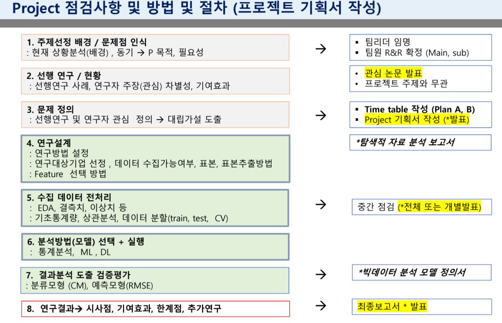

[참고] 부실예측 모형이 갖추어야 하는 속성
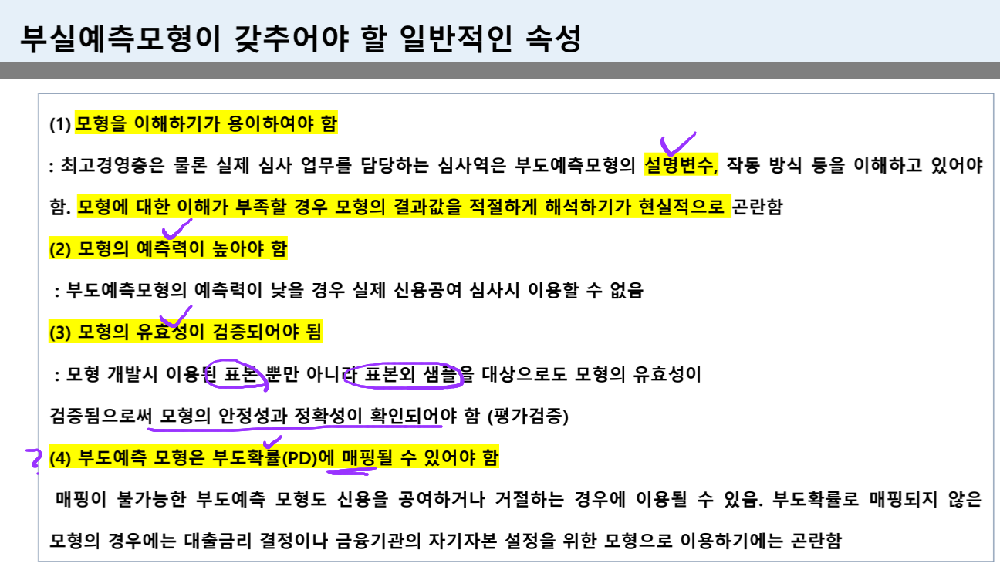

-----
# 1. 선행연구 / 현황
[양식]
    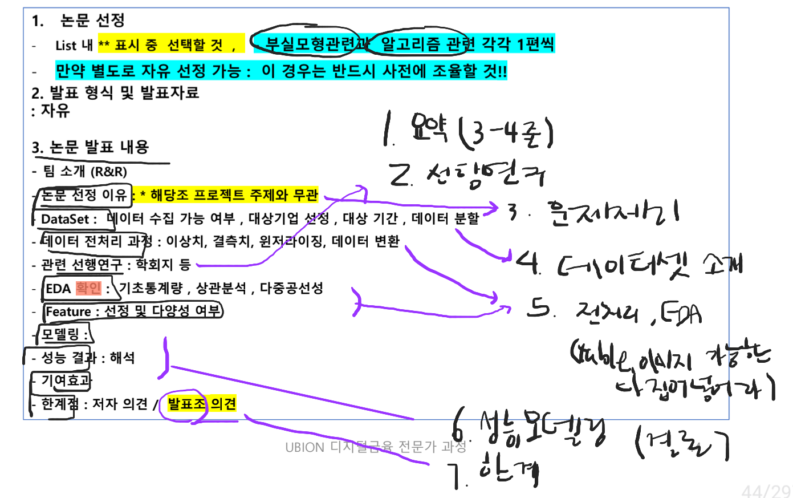

----
# 2. 문제 정의

## 2-0. 프로젝트 제목명
✅주요산업별·현금흐름패턴별 임계값 최적화를 통한
머신러닝 기반 주요 산업별 부실화기업 조기경보시스템

## 2-1. 연구 배경

① 한국 한계기업 급증 현황
한국은행 2024년 기업경영분석 결과에 따르면, 국내 외부감사 대상 비금융 영리법인 중 이자보상비율(ICR) 100% 미만 기업 비중이 40.9%로 역대 최대치를 기록하였다. 3년 연속 ICR이 1 미만인 한계기업(좀비기업) 비중 또한 17.1%로 2010년 이후 최고 수준이다.

한국경제인협회(2025): 2024년 3분기 상장사 한계기업 비중 19.5% — G5+한국 중 미국(25%)에 이어 2위
코스닥 한계기업 비중(23.7%)은 코스피(10.9%)의 약 2배, 2016년 대비 17.1%p 급증
3년 이상 한계 상태 지속 비중: 2023년 36.5% → 2024년 44.8%로 악화
업종별: 부동산업(39.4%), 숙박음식업(28.8%), 건설업 순으로 한계기업 비중 집중

② ICR 임계값의 산업별 이질성 — Federal Reserve(2019)

📄 Federal Reserve (Palomino et al., 2019) 핵심 발견
산업별 ICR 임계값 이질성
  • 동일한 ICR 수준이 산업별로 다른 부도율과 연관됨을 실증
    • Retail 업종: ICR 5.1 → 부도율 1.5% / ICR 2.7 → 부도율 3%
    • Communications: ICR 3.3 → 부도율 1.5% / ICR 2.8 → 부도율 3%
  → 같은 ICR 수준도 산업에 따라 위험 신호 강도가 다름

대출 코버넌트 기반 업종별 임계값 차이
    • 화학·기계장비 등 고위험 업종: 중앙값 ICR 임계값 3.0
    • 통신·비예금기관 등 저위험 업종: 중앙값 ICR 임계값 1.0~2.0
  → ICR < 1 단일 기준은 업종 특성을 반영하지 못한 과도한 단순화

*참고: 대출 코버넌트란 은행이 돈을 빌려줄 때 계약서에 적는 조건이에요."당신 회사 ICR이 X 아래로 떨어지면 기술적 부도로 간주합니다. 이 X값이 업종마다 다르게 설정된다는 거예요.

③ 기존 부실예측의 방법론적 한계
단일 임계값의 한계: 산업별, 기업 생애주기별 위험 이질성 무시 (Federal Reserve, 2019) (Nguyen et al., 2025)
블랙박스 문제: 예측 근거 불투명으로 금융기관 실무 활용 제한 → XAI 필요성

## 2-2. 연구 목적

## 2-3. 연구 가설

## 2-4. 프로젝트 일정(Time Table)

## 2-5. 사용자, 기대효과
사용자: 은행, 증권사
기대효과: 기업 부실 조기 탐지, 선제적 여신관리 심화, 부실채권 예방, 잠재부실기업 집중관리 가능, 산업별 리스크 고도화, 금융기관의 건정성과 안정성 확보

## 2-6. 연구 플로우차트

[발표준비]
- 연구흐름을 한 페이지에 집어넣을 것
- 논리적 보고서 -> 알기 쉬운 보고서 -> 전달력이 아름다운 보고서
- 기획서에 성능향상을 위해서, 하이퍼파라미터 최적화 방법이라던가, cross-validation 어떻게 할지에 대해서 정리할것
- '파라미터 설정한 것에 대한 내용' 부록에다가 집어넣기
- 스케일링을 했을때랑, 안했을때의 모델 성능차이가 얼마나 차이가 나는지 확인

----
# 3. 연구설계
## 3-1. 연구대상기업 선정과 데이터 분류

### a. 기업 범위, 시장 구분
1. 상장기업 VS 비상장기업 , 외감기업VS 비외감기업
[확정]
- 코스닥기업에 상장된 기업, 비상장 외부감사기업 (폐지사 포함)
- 금융업종 제외 : 별도 회계기준 적용 , 금융회사에게 정상적인 높은 레버리지 상황이 비금융회사에게는 같은 의미를 가지지 않기 때문

[이유]
 KOSPI 상장된 기업의 경우,  코스닥 대비 부실기업이 적음. 이미 클래스 불균형이 심한데, kospi 상장된 기업들을 데이터에 추가하면 더 큰 클래스 불균형 발생할 수 있기에 제외함.

### b. 산업 분류

[확정,이유]
https://mods.go.kr/board.es?mid=a10403040000&bid=107&act=view&list_no=428660

기업 부실위험예측 과정에서 산업별 재무적 특성과 부실 발생 메커니즘이 상이하다는 점을 고려하여 산업별 개별 모델을 구축하고자 하였다. 한국표준산업분류(KSIC) 11차 대분류를 기준으로 산업을 나눌려고 했다. 대분류에 가장 큰 비중을 차지하는  제조업 내에서도 전자부품, 화학, 자동차, 기계장비 등은 자산구조, 부채구조, 경기민감도, 재고특성 및 현금흐름 구조가 상이하므로 하나의 통합모형으로 학습할 경우 산업 내부 이질성으로 인해 예측력이 저하될 가능성이 존재한다. 따라서 기업의 경제적 동질성을 확보하기 위해 통계청 한국표준산업분류(KSIC) 11차 중분류 수준을 기준으로 산업을 세분화하였다.

다만 산업을 과도하게 세분화할 경우 산업별 표본 수와 부실기업 수가 부족해지는 문제가 발생할 수 있다. 본 연구에서 부실기업은 “이자보상비율(ICR)이 3년 연속 1 미만인 기업”으로 정의하였기 때문에 일반적인 부실 정의보다 이벤트 수가 적게 나타날 가능성이 높다. 이러한 상황에서 표본 수가 지나치게 적은 산업까지 독립적으로 모델링할 경우 학습 불안정성, 과적합(overfitting), 클래스 불균형 심화 등의 문제가 발생할 수 있다.

이에 따라 본 연구에서는 산업별 충분한 학습표본을 확보하면서도 산업 특수성을 반영할 수 있도록, 전체 기업 중 일정 수준 이상의 비중을 차지하는 중분류 산업만을 분석 대상으로 선정하였다. 구체적으로는 전체 표본 대비 중분류 산업 비중이 2% 이상인 산업만을 최종 분석대상으로 설정하였다. 이에 따라 총 17개의 산업군이 선정되었으며, 이는 전체 비상장 외감기업 및 코스닥 상장기업의 약 72%를 포괄한다.

이는 산업별로 충분한 표본 수를 확보하여 안정적인 부실위험예측 모형을 구축하기 위함이다. 산업을 과도하게 세분화할 경우 특정 산업에서는 부실기업 수와 전체 표본 수가 지나치게 부족해져 모델의 학습 안정성이 저하될 가능성이 존재한다. 따라서 본 연구에서는 산업 특수성을 반영할 수 있을 정도의 세분화를 유지하되, 동시에 충분한 기업 수가 확보된 주요 산업군을 중심으로 분석을 수행하였다.

또한 기업 수 비중이 높은 산업군을 우선적으로 분석함으로써, 실제 기업 분포를 보다 잘 반영하면서도 다양한 산업에 적용 가능한 실무적 활용성을 확보하고자 하였다.

[산업별로 데이터셋을 나눠서 학습하는 이유]
산업 특화된 미세한 패턴(예: 제조업의 높은 부채비율은 정상이나, 서비스업은 위험 등)을 아주 잘 포착함

그러나 한계로는 특정 산업(예: 바이오, 예술 등)의 샘플 수가 너무 적으면 모델이 제대로 학습되지 않아 성능이 급락함. 
이러한 이유로, 데이터가 모든 산업에 걸쳐 충분하게 산업 분류 기준을 결정해야함

 

## 3-2. 부실기업 정의
[확정]
 ICR < 1이 3년 연속인 기업 = 1 (부실) / 0 (정상) [Bok 금융안정보고서]
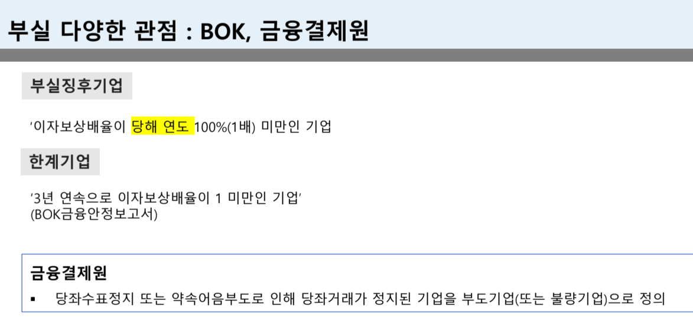

한계기업은 재무구조가 부실해, 영업 활동으로 창출된 이익으로 이자비용조차 감당하지 못하는 기업을 뜻한다. 사실상 경쟁력을 상실해 더 이상의 성장을 지속할 수 없는 기업을 의미하는 말이다. 한계기업에 대한 정의는 다양하지만, 통상 3년 연속 이자보상비율(영업이익/이자비용)이 1보다 작은 기업을 한계기업으로 판단하고 있다.[출처 : 제정경제부 시사경제용어사전 https://mofe.go.kr/sisa/dictionary/detail?idx=2833]

[참고] 
용어를 임의로 정하지 말고 근거와 기준을 가지고 정의
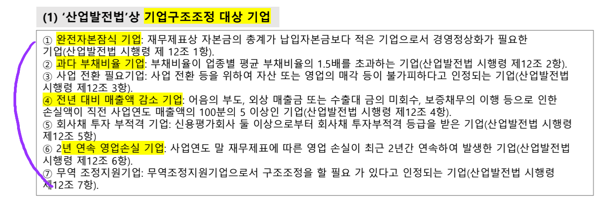
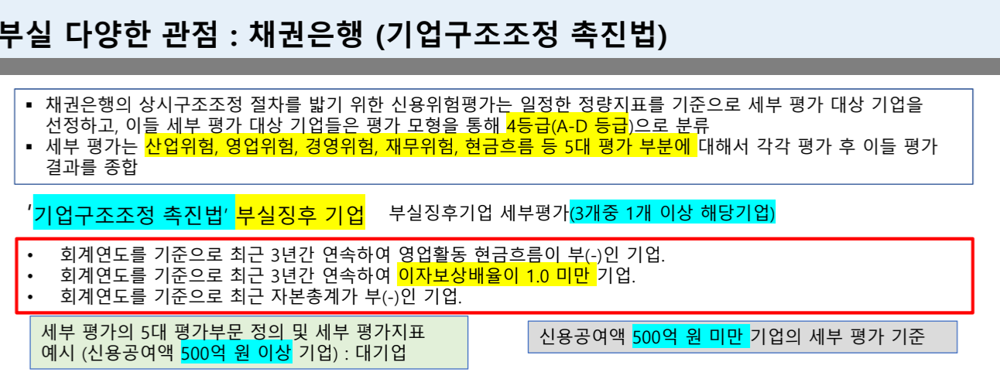
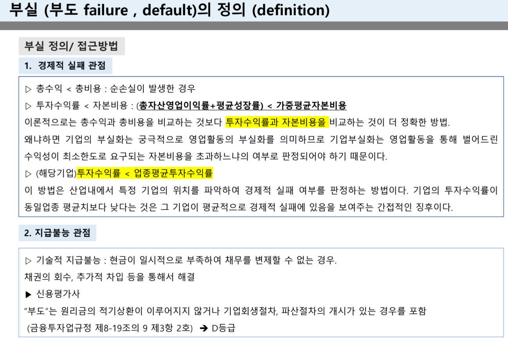

상장기업
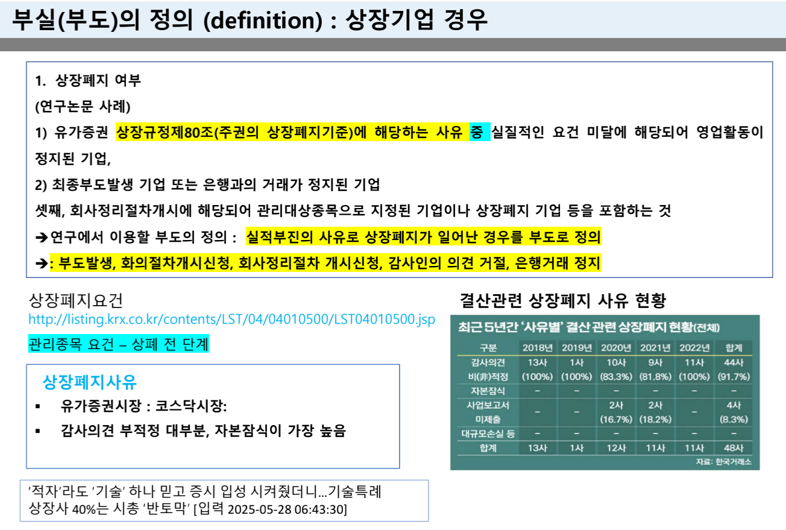

상장폐지
ts2000에서 상장 폐지 사유를 가져올 때
→ : 부도발생, 화의절차개시신청, 회사정리절차 개시신청, 감사인의 의견 거절, 은행거래 정지

대부분의 중소기업 B , 신용등급이 안좋을 것 같으면 평가를 받지 않음

## 3-3. 피처 선택
[참고] 데이터 분석 목적 중요 -> 재무비율 우선선위 선정가능 (피처 선정)
우선 가능한 데이터들 선별해서 가져오려고 하지 말고, 다 가져오고 나서 차원축소 해서 피처 수를 줄이면 됨

### a. 생애주기 피처 생성. 생애주기를 어떻게 나눌까?
[확정] 디킨즈 모형

[참고]
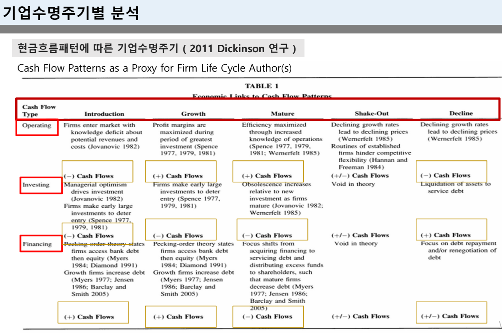

(생애주기, 산업별)

[확정파생피처]
- 현금흐름 → 영업현금흐름은 (분모) , 총자산(분자)  규모에 맞춰서 보정이 들어가야한다
- 디킨즈 모형으로 생애주기별로 나누고, 레이블 인코딩해서 1,2,3,4,5 형식으로 제작
- 동일 산업에서 상위에 속한 기업의 재무비율 (Ecos에서 데이터 수집) or 동일 산업의 평균 재무비율에다가 자회사의 재무비율 빼거나 더하기
- 기업의 규모 : 총자산, 매출액
- 영업활동기간
- 운전자본/매출액
- 당좌자산/유동부채

- 재무비율
- 재무제표: 성장성 지표 (매출액증가율, 순이익증가율, 영업이익증가율, 총자산증가율)
- 재무제표: 활동성 지표 (총자산회전율, 자기자본회전율, 재고자산회전율)
- 재무제표: 수익성 지표 (ROA, ROE, ROIC)

[참고]

고려할 파생변수
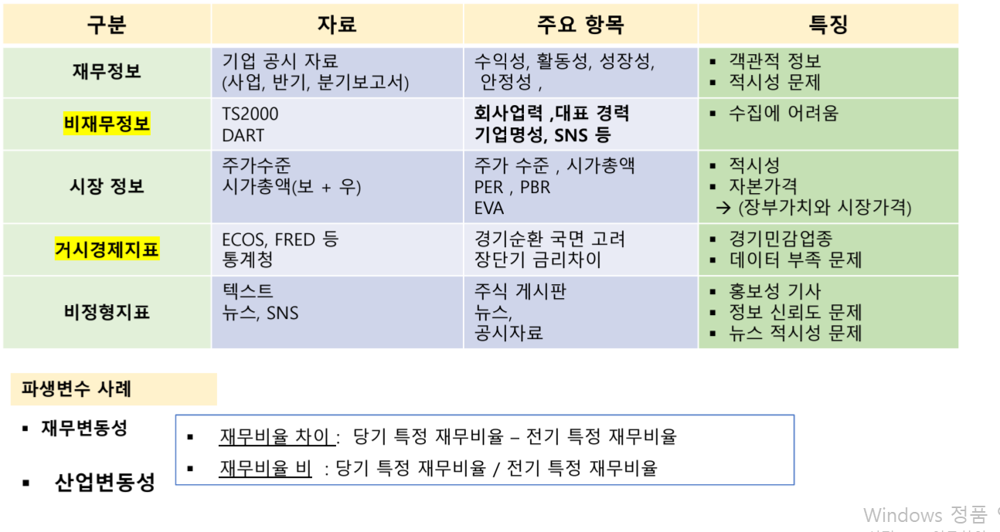

상장기업에 적용할 수 있는 피처
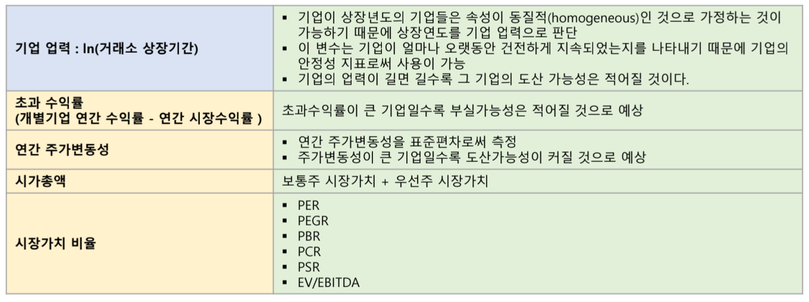

상장기업이 아니여도 적용할 수 있는 피처
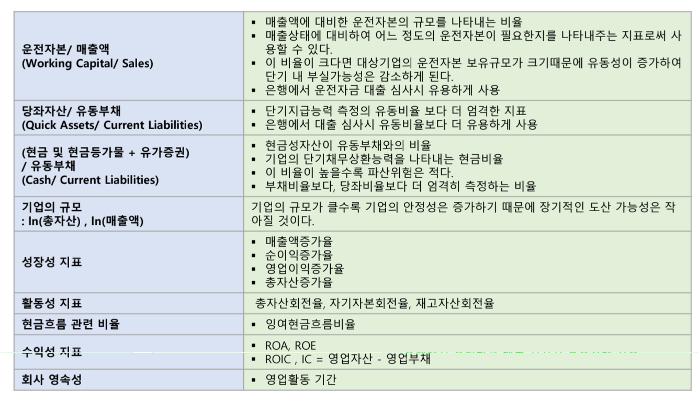

### a. 데이터수집 가능 여부 + 출처 명시 
[확정]
- 산업 평균 재무비율 : ECOS
- 재무제표 : TS2000
- 데이터 수집기간: 2011-2024 (기간 선정이유: 2011년을 시작으로 한 이유-IFRS 도입시점, 2024년을 끝으로 본 이유-2025 사업보고서 아직 미완성, 외감 보고 지연, 재무제표 수정, 상장폐지 기업 정리 지연, 부도 여부 확정 지연 등 때문에  “확정된(clean) 데이터”를 확보하기 어려워서 )

----
# 4. 데이터 수집 및 전처리
## 4-1. 데이터 수집 및 병합
[확정]
패널 데이터 기준으로 데이터 수집

[참고]
- 재무제표 사용 시 IFRS, GAAP 구분 -> 연결 재무제표 사용
- 상장 전과 후의 재무데이터를 합치는 경우 상장 전에 연결 재무제표가 없다면 상장 전	개별, 상장 후	연결 합치기

### 통계적 유의성 파악 (피처 셀렉)
[참고] t-통계량, 회귀분석(beta)
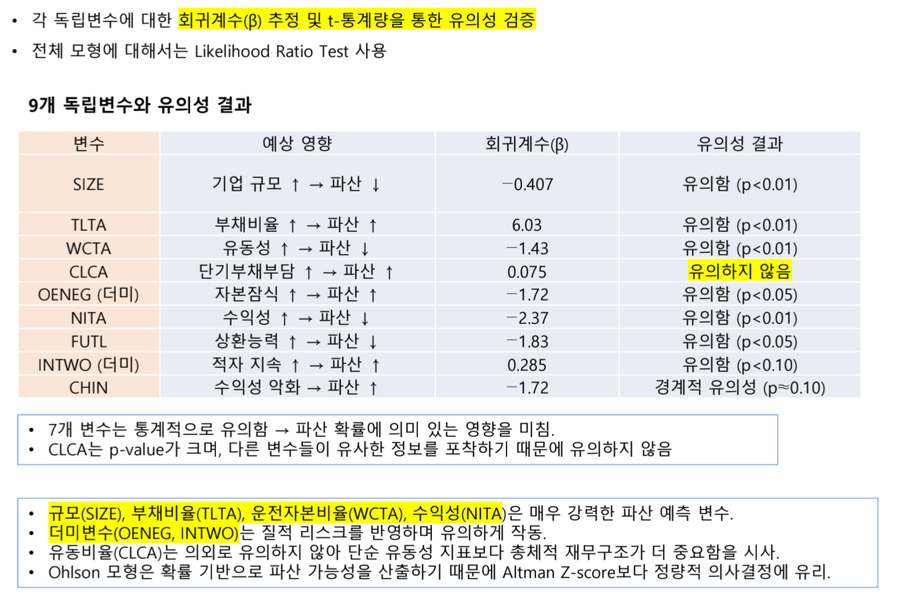

## 4-2. 변수 기준시점 정렬 기준시점 통일

## 4-3. EDA

### a.기초 통계량
[참고]feature 상관분석 하기 전에 describe()로 기술 통계량 확인

### b. 분포확인
- 정규성 만족하는지 확인 목적
    [이유] 정규성을 왜 만족해야하는가? 통계적 추론(p-value, 신뢰구간 등)이 제대로 성립하도록 하기 위해서

### c. 결측치 확인
### d. 상관분석

## 4-4. 결측치처리
[처리방법]
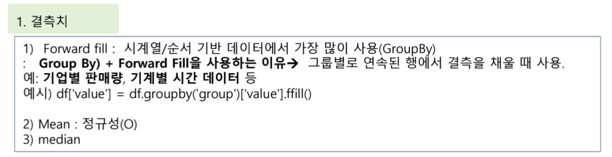

## 4-5. 이상치 처리
[탐지방법]
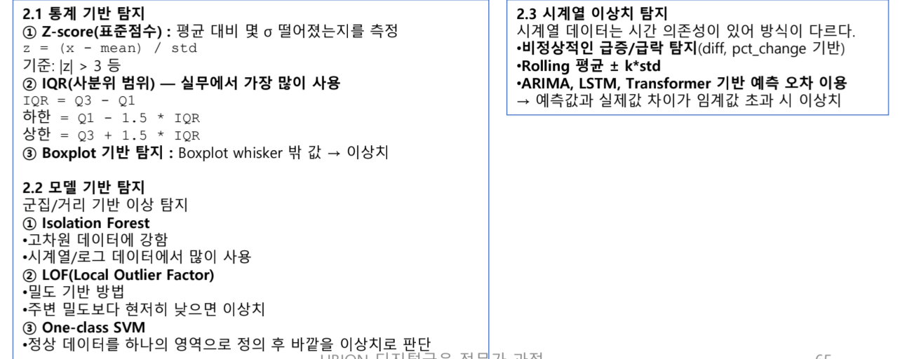

[처리방법]
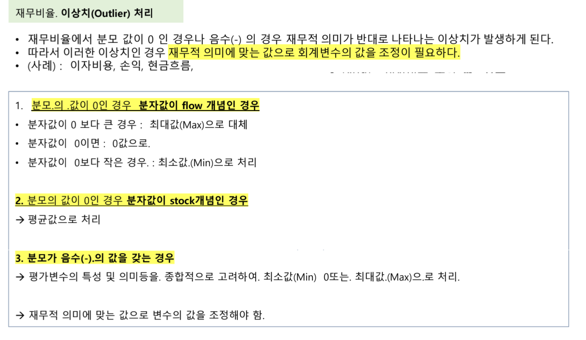
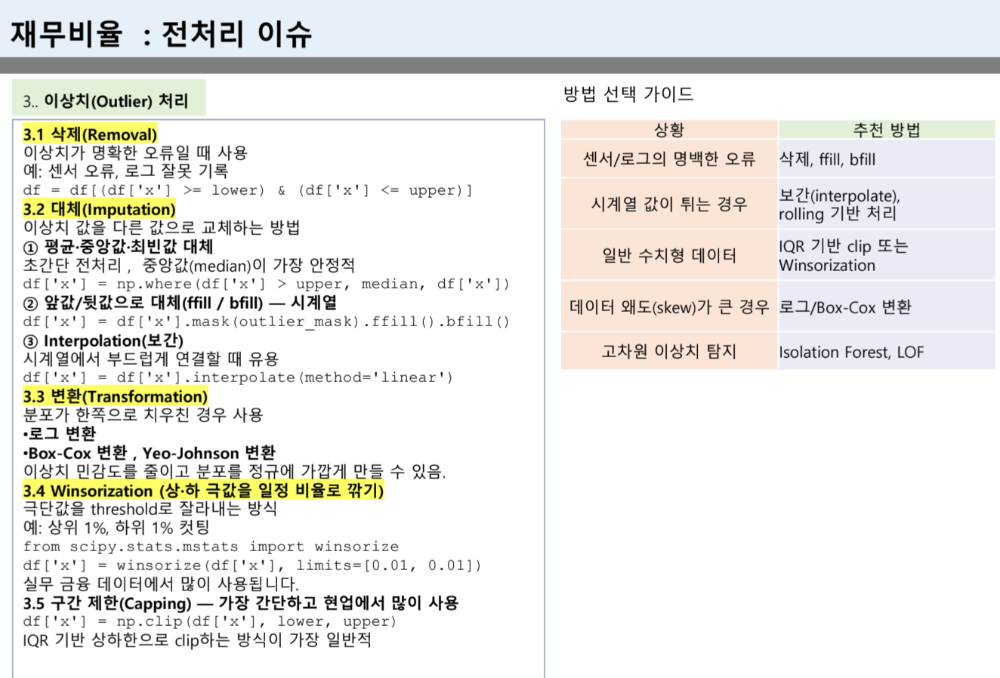

## 4-6. 변수 변환 
- 단위 통일
- 정규성 검정 및 전처리 (로그변환)
- 정상성 검정 및 전처리 (차분)

[참고]
-  기업규모에 따른 부도확률 차이를 반영하기 위해 총자산의 자연로그 전처리할 것

## 4-7. 시차(Lag) 생성   

## 4-8. 범주형 인코딩
- 특정업종을 더미변수 (dummy variable) 로 처리 : ex. 건설업종

## 4-9. 다중공선성 처리 (VIF)

## 4-10. 피처 셀렉션

## 4-11. 피처 클래스 불균형 처리 (리샘플링) - 중요!
[참고]
- Train 데이터에만 적용할 것 
- CTGAN 사용하는것 추천 ()
- 부실예측분석 [통계.ML] 파일에 해당관련 내용 존재함
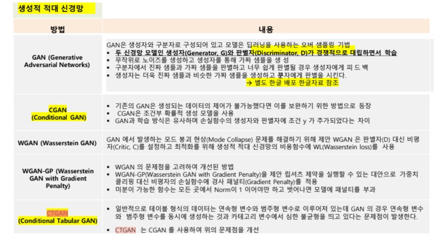
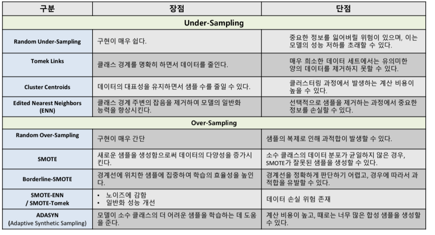
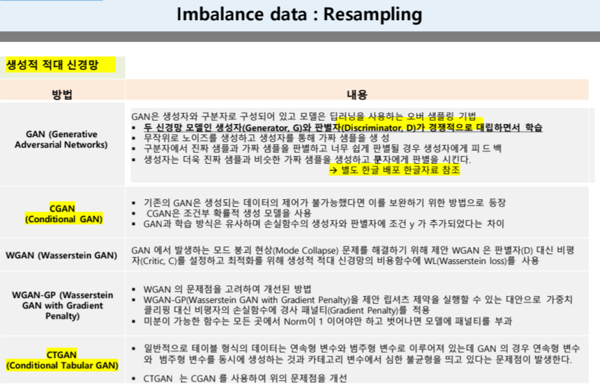
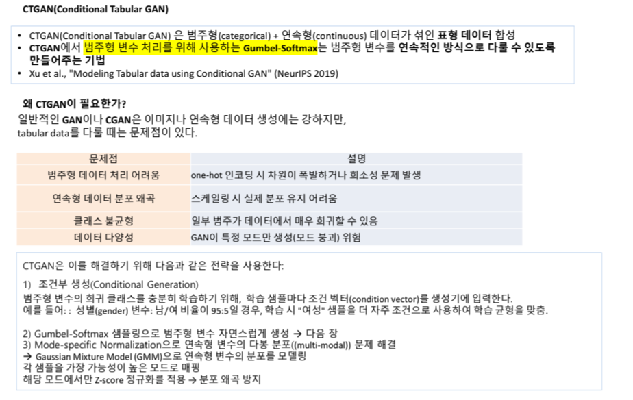

[처리방법]
SMOTE
Boderline SMOTE
언더샘플링
Class Weight
Balanced Random Forest
Focal Loss

## 4-12. 데이터 분할 및 검증전략

## 4-13. 스케일링
[참고]  데이터 분할 후 스케일링 진행
(로지스틱 회귀 모형을 사용하기 위해서)

## 4-14. 데이터 누수 방지되고 있나 확인

## 4-99. 기타 전처리
- 파생변수 생성 (이동평균, 증감률, 상호작용 피처, rolling volatility) 고려

-----

# 5. 분석 모델 선택 및 실행
[필수] 로지스틱 Regression은 필수로 집어넣기

## 5-1. 베이스라인 모델
로지스틱 회귀모형

## 5-2. 머신러닝 모델

## 5-3. 딥러닝 모델

## 5-4. 하이퍼파라미터 튜닝

## 5-5. K-fold 교차검증

---

# 6. 결과분석 도출 성능평가

## 6-1. 평가 지표

## 6-2. 검증 방법

ex. Train / Valid / Test
Time-series split
Walk-forward validation

----
# 7. 시사점, 기여효과, 한계점, 추가연구  (최종보고서+발표)

