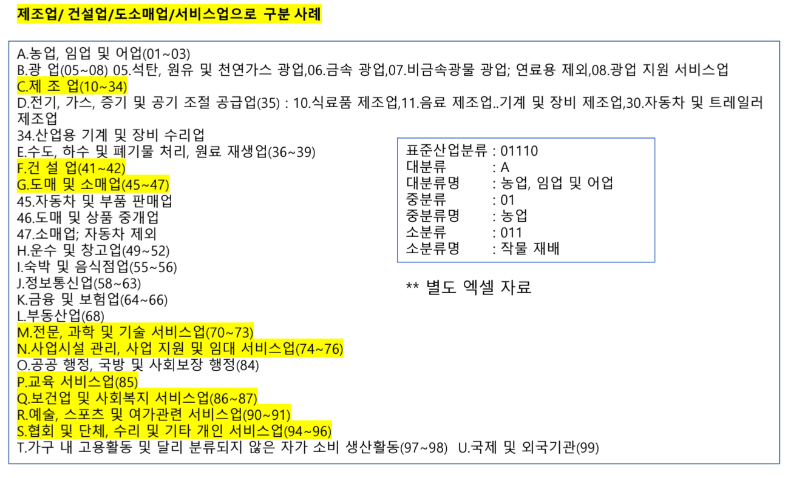

팀장: 혜원
서기(오전수업기록, 회의기록, 교수님피드백 기록): 혜원(목-영경), 영경, 윤태
간식 담당: 혜원

규칙 (벌칙):
-  지각시-> 커피 쏘기
-  결석시->  밥 사기
- 자신이 맡은 일 기한까지 못함 -> 간식, 커피 사기

팀명: 금쪽이 트리오

논문발표 : 영경, 윤태
기획발표 : 영경
중간발표 : 혜원
최종발표 : 윤태

+자산배분, 투자전략 할거임? : 일단 목표는 더 파생해서 프로젝트를 할 것임. 미정. 

부실기업 예측 논문:
알고리즘 논문:

[참고] 프로젝트 절차

-----
# 1. 선행연구 / 현황
[양식]
    

----
# 2. 문제 정의
- 선행연구 및 연구자 관심 정의 -> 대립가설 도출
- time table 작성
- 프로젝트 기획서 작성

----
# 3. 연구설계
## 3-1. 연구대상기업 선정
1. 상장기업 VS 비상장기업 + 데이터 준비 (상장폐지기업) 부실기업으로 전처리 필요함)
- (상장기업의 경우도 시장별 : 코스피시장, 코스닥시장 )
- 금융업종 제외 : 별도 회계기준 적용 , 금융회사에게 정상적인 높은 레버리지 상황이 비금융회사에게는 같은 의미를 가지지 않기 때문
- 결산월 : 12월 결산법인  결산월의 차이 ? (분자의 회계 재무변수와 분모의 시가총액 시점이 일치하지 않는다는 점)

2. 외감기업VS 비외감기업
3. 제조업 vs 비제조업 (서비스업) 
4. 산업별 : 섹터별/ 업종별로 세분화 , 일반업종 VS IT업종 , 수출업종과 그 외, 주력산업과 그외
5. 기업규모별 : 대 / 중소기업 , 중소형주
6. 체계적위험별 구분
(국면 구분)
- 경기국면을 고려 (통계청, GDP+물가, 개별경제지표) , 현금흐름패턴 고려 (수명주기분석) – 흑자도산, 좀비 (이자보상) TS 2000 참조

-  상장기업 : KOSPI는 코스닥 대비 부도기업이 부족  표본 불균형 심각
-  특정 산업별 연구 : 데이터 부족
-  비상장기업을 표본에 포함시키는 것은 비상장기업의 재무자료 신뢰성 문제
    -  연구결과가 왜곡 가능성 존재
-  특정업종을 더미변수 (dummy variable) 로 처리 : 건설업종
-  기업규모와 부도확률간의 관련성을 통제하기 위해 총자산에 상용로그를 취한 값을 변수로 투입

## 3-2. 피처 선택
[참고] 데이터 분석 목적 중요 -> 재무비율 우선선위 선정가능 (피처 선정)

[참고]
대분류

고려할 파생변수

[참고] 부도예측시 중요한 피처
1. 이자보상비율 1이상
2. 부채비율 300% 이상

## 3-3. 데이터수집 가능 여부 +출처 명시

----
# 4. 데이터 수집 및 전처리
## 4-1. EDA

### a.기초 통계량
### b. 상관분석

## 4-2. 결측치처리

## 4-3. 이상치 처리

## 4-4. 정규성 검정

## 4-99. 피처 셀렉션

-----

# 5. 분석 모델 선택 및 실행

---

# 6. 결과분석 도출 검증평가

----
# 7. 시사점, 기여효과, 한계점, 추가연구  (최종보고서+발표)

