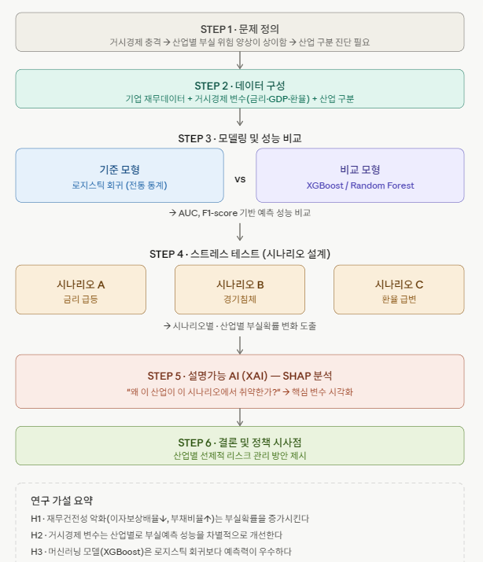

# [프로젝트명] : (거시경제 환경 변화에 따른) 산업별 부실위험 진단을 위한 설명가능 AI 기반 스트레스 테스트

## 1. 연구 배경
1. [거시경제 환경 변화에 따라 산업별 부실 위험의 양상이 구조적으로 상이]

→ 2022년 금리 인상기에는 제조업·부동산업 중심으로 한계기업이 집중되었고, 2024년 고금리·고물가 복합 충격 하에서는 건설업의 부실확률이 5년 만에 2배로 급등하는 등 충격의 종류와 시기에 따라 취약 업종이 달라졌다. 
이는 거시경제 환경을 시나리오로 설정하고, 산업별로 분리하여 부실 위험을 진단하는 스트레스 테스트 모형의 필요성을 직접적으로 시사함

<2025 기사>
https://www.fki.or.kr/kor/news/statement_detail.do?category=ST&bbs_id=00036119
기업들의 평균 부실확률은 2019년 5.7%에서 단계적으로 증가하여 2024년에는 8.2%에 달했으며, 이는 코로나19 직전 이후 6개 년도 중 가장 높은 수치다. 업종별로는 부동산·임대업(24.1%) 부실확률이 가장 높았으며, 건설업은 2019년 3.3%에서 2024년 6.1%로 부실확률이 2배 증가했다. 건설업 부실확률 급등의 주요 원인은 고물가로 인한 건설 수주 부진, 고금리 지속, 부동산 PF 부실 문제였다.

<과거 2022 기사>
https://www.sedaily.com/article/13459661
KDB미래전략 연구소 보고서에 따르면,  인플레이션과 금리 상승 등 경영 환경 악화로 한국의 3년 연속 이자보상배율 1 미만인 한계기업 수는 꾸준히 증가했으며, 업종별로는 제조업(1,294개), 부동산·임대업(1,182개), 도소매업(367개) 순으로 한계기업이 집중되어 있었다. 특히 숙박·음식점업(46.0%)과 부동산·임대업(35.3%)은 한계기업 비중과 증가 폭이 두드러졌다. 수익성 개선 없이 대출금리 상승 압력이 높아지면 채무불이행 위험이 고조될 수밖에 없다. 

2. [설명가능 AI(XAI)에 대한 규제적 요구 — 실무적 필요성]

-> 글로벌 금융 규제 때문에, 설명가능성을 확보해야 한다는 연구 동기가 됨

https://oraclelawglobal.com/news/artificial-intelligence-in-the-financial-sector/

EU AI Act(2024년 발효), DORA, MaRisk 등 주요 금융규제는 AI 기반 신용 리스크 모델에 대해 설명가능성 확보, 지속적 검증, 데이터 품질 유지를 의무화하고 있다. 금융기관은 AI 기반 의사결정(예: 신용평가)을 설명할 수 있어야 한다 

[참고만 해주세요]
<해당 기사의 핵심 내용>
- AI Act (EU 2024/1689) : 2024년 8월 발효된 세계 최초 포괄적 AI 법으로, 신용평가 시스템을 고위험(High-Risk) 으로 분류해 리스크 관리·데이터 품질·인간 감독·투명성 요건을 부과한다. 위반 시 최대 €3,500만 또는 전 세계 매출액의 7% 벌금이 부과된다.
- DORA : 은행·보험·투자사 등 금융기관 전반에 ICT 리스크 관리, 사이버 인시던트 보고, 운영 탄력성 테스트를 의무화한다. AI 서비스를 클라우드로 아웃소싱해도 금융기관이 모든 리스크 책임을 진다.
- MaRisk (독일 감독 기준) : AI 모델 배포 전 적절성 평가, 지속적 검증, 설명가능성 확보, 데이터 품질 유지를 요구한다. 즉 신용 AI 의사결정은 반드시 설명 가능해야 한다.

## 2. 연구 목적
거시경제 환경 변화(금리, GDP, 환율, 물가 등)가 산업별 기업 부실 위험에 미치는 영향을 설명가능 AI(XAI) 기반 스트레스 테스트 프레임워크로 진단하는 것을 목적으로 한다. 

구체적으로는 
① 머신러닝 모델의 예측력 우위 검증, 
② 거시변수의 산업별 차별적 영향 분석, 
③ SHAP 기반 설명가능성 확보를 통한 실무·규제 적용 가능성 제시를 목표로 한다.

## 3. 연구 가설
H1: 재무건전성 악화(이자보상배율↓, 부채비율↑ 등)는 부실확률을 증가시킨다   
    [배경이 되는 이론이나 선행연구] : 전통 Z-score, 한계기업 이론

H2 : 거시경제 변수(금리, GDP성장률, 환율, PPI)는 산업별로 부실예측 성능을 차별적으로 개선한다
    [배경이 되는 이론이나 선행연구] : 산업별 금리민감도 이론, 스트레스 테스트
    
H3 : 머신러닝 모델(XGBoost, RF 등)은 전통 통계모형(로지스틱 회귀)보다 예측력이 우수하다
    [배경이 되는 이론이나 선행연구] :ML vs. LR 비교 선행연구

## 4. 연구의 독창성
1. 산업 세분화 : 제조업·건설업·서비스업 등 산업별로 거시변수 효과를 분리 분석
2. 스트레스 시나리오 : 금리 급등, 경기침체, 환율 급변 등 복합 시나리오 설계
3. XAI 통합 : SHAP Summary Plot / Force Plot으로 예측 근거를 시각화하여 실무 활용성 확보

-----

프로젝트 목표
### 1단계 — 부실위험 예측

향후 N개월 내:

부실화
관리종목 지정
상장폐지 가능성

예측.

### 2단계 — 조기경보시스템(EWS)

기업 위험 급등 시:

이상징후 Trigger 생성
실시간 위험등급 변화 탐지

수행.

### 3단계 — 회복패턴 분석

부실 이후 기업을:

회생 성공 기업
재부실 기업
상장폐지 기업

으로 분류하고 패턴 비교.

### 4단계 — Turnaround 예측모델

부실기업 중:

“회복 가능성이 높은 기업”

예측.

### 5단계 — LLM 기반 투자 리포트 생성

최종적으로:

위험요인
회복 가능성
핵심 Trigger
투자 의견

을 자동 요약하는 AI 리포트 생성.

[재무 + 시장 + 공시 + NLP 데이터 수집]
                    ↓
             [파생변수 생성]
                    ↓
           [부실위험 예측모델]
        (XGBoost / LightGBM)
                    ↓
              [PD 시계열 추적]
                    ↓
          [조기경보 Trigger 탐지]
                    ↓
         [위험등급(EWS) 산출]
                    ↓
        [부실 이후 회복패턴 분석]
                    ↓
         [Turnaround 예측모델]
                    ↓
      [LLM 기반 투자 리포트 생성]